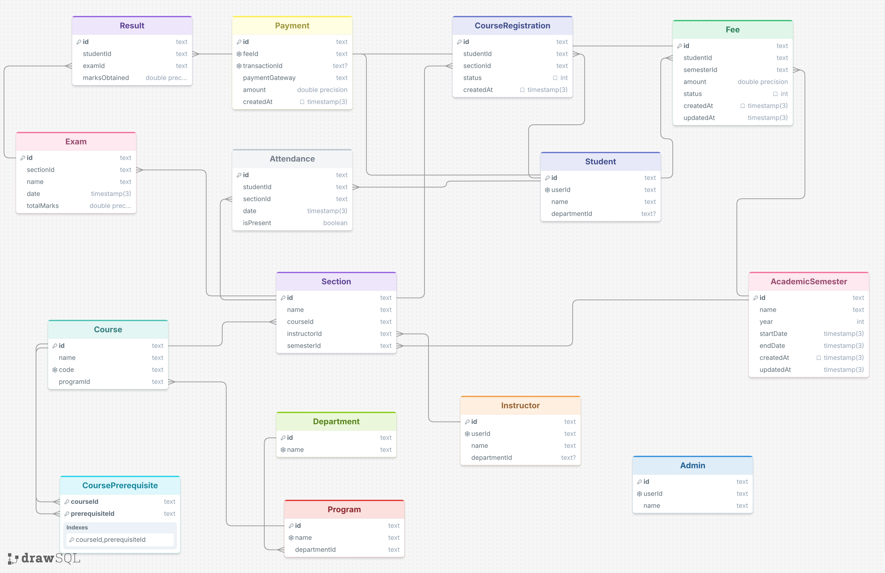

# 🎓 University Management System Backend

A robust, scalable, and secure RESTful API built for managing university operations. This backend handles everything from student enrollment and course prerequisites to real-time Stripe payment integration for tuition fees, automated GPA calculations, and academic transcript generation.

## 🗄️ Database ERD


---

## 🚀 Key Features

- **Role-Based Access Control (RBAC):** Distinct roles for `STUDENT`, `INSTRUCTOR`, and `ADMIN` ensuring secure boundaries.
- **Authentication:** Standard Email/Password authentication along with **Google Cloud (GCP) Social Login** integration via JWTs.
- **Academic Hierarchy:** Manage Departments, Programs, Courses, and Prerequisites smoothly.
- **Course Registration & Fees:** Transaction-safe course enrollment engine that automatically generates UNPAID tuition fees to prevent race conditions.
- **Payment Integration:** Live **Stripe** webhook integration to process payments and auto-update fee statuses.
- **Grading & Transcripts:** Advanced logic allowing instructors to submit marks and the system to auto-calculate CGPA and generate detailed student transcripts.
- **Data Integrity:** Fully relational PostgreSQL database modeled efficiently using Prisma ORM with strict Zod validation on all API endpoints.

---

## 🛠️ Tech Stack

- **Runtime:** [Node.js](https://nodejs.org/) (v24+)
- **Framework:** [Express.js](https://expressjs.com/) (TypeScript)
- **Database:** [PostgreSQL](https://www.postgresql.org/)
- **ORM:** [Prisma v5](https://www.prisma.io/) (utilizing `prismaSchemaFolder` for modular schema design)
- **Validation:** [Zod](https://zod.dev/)
- **Security:** Helmet, CORS, Express-Rate-Limit, bcrypt
- **Payments:** [Stripe](https://stripe.com/)
- **Auth:** jsonwebtoken (JWT), google-auth-library

---

## ⚙️ Installation & Setup

1. **Clone the repository:**
   ```bash
   git clone <your-repo-url>
   cd university-management-system
   ```

2. **Install dependencies:**
   ```bash
   npm install
   ```

3. **Environment Configuration:**
   Copy the example environment file and fill in your secrets.
   ```bash
   cp .env.example .env
   ```
   *Make sure to configure your `DATABASE_URL`, `JWT_SECRET_KEY`, `STRIPE_SECRET_KEY`, and `GOOGLE_CLIENT_ID`.*

4. **Database Migration & Generation:**
   Push the schema to your database and generate the Prisma Client.
   ```bash
   npx prisma db push --accept-data-loss
   npx prisma generate
   ```

5. **Seed the Database:**
   Populate the database with the default Super Admin account.
   ```bash
   npx prisma db seed
   ```
   *The default admin credentials are:*
   - **Email:** `admin@ums.com`
   - **Password:** `securepassword123`

6. **Start the Development Server:**
   ```bash
   npm run dev
   ```
   The server will start running on `http://localhost:5000`.

---

## 📖 API Documentation

The complete API documentation, including request payloads and response structures for all 20+ endpoints, can be found in the [api-documentation.md](./api-documentation.md) file.

**Key Endpoint Categories:**
- `/api/v1/auth` - Login, Register, Refresh Token, Social Login
- `/api/v1/users` - User Management
- `/api/v1/departments` & `/api/v1/programs` - Structural Academic Units
- `/api/v1/courses` & `/api/v1/sections` - Curriculum & Classes
- `/api/v1/course-registrations` - Student Enrollment
- `/api/v1/payments` - Stripe Intent Generation & Webhooks
- `/api/v1/academic-records` - Attendance, Exams, Results, and CGPA Transcripts

---

## 🛡️ Best Practices Implemented

- **Modular Architecture:** Routes, Controllers, Services, and Validations are cleanly separated by domain entity.
- **Transaction Safety:** Prisma `$transaction` blocks are used for multi-step database mutations (e.g., Course Registration + Fee generation).
- **Graceful Error Handling:** A global error handler catches and cleanly formats all exceptions, including Zod validation errors, Prisma constraint violations, and custom `AppError` throws.
- **Secure Webhooks:** Express raw body parsing is selectively applied only to the Stripe webhook route to ensure signature verification passes flawlessly.
- **Scalable Schema Design:** The Prisma schema is broken down into modular files (`academic.prisma`, `finance.prisma`, etc.) utilizing Prisma's latest `prismaSchemaFolder` feature.